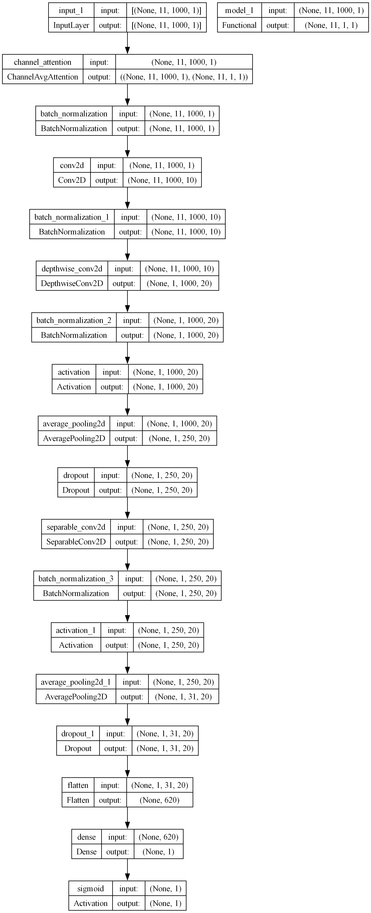

# MEG-Based ADHD vs Healthy Control Classification

## Overview

This project explores deep-learning–based classification of **ADHD and healthy control subjects** using MEG recordings.  
The focus is on building an end-to-end signal processing and modeling pipeline, with additional emphasis on interpretability through attention mechanisms.

---

## Data Processing Overview

- Raw MEG recordings are loaded from MATLAB (`.mat`) files.
- Only MEG channels present across all trials are considered.
- Channels are grouped and averaged into broad anatomical regions (e.g., temporal, frontal, occipital).
- Signals undergo band-pass filtering and temporal downsampling.
- Processed features are represented as region-wise time series.

---

## 🧩 Model Architecture

The model pipeline consists of:
- Temporal feature extraction layers
- A **channel attention mechanism** that assigns relative importance to regions
- A fully connected classification head

The attention component provides a coarse indication of spatial emphasis within the learned representation.

<p align="center">
  
</p>

---

## 🔍 Evaluation Protocol

- Performance is assessed using a **Leave-One-Subject-Out (LOSO)** evaluation scheme.
- In each fold, one subject is held out for testing while remaining subjects are used for training.
- Metrics are summarized across folds for reference.

---

## 📈 Representative Results

The following results correspond to one experimental configuration and are reported for contextual reference:

| Metric        | Mean (%) | ± Std |
|---------------|----------|-------|
| Accuracy      | 87.300   | 17.591 |
| Sensitivity   | 84.733   | 21.248 |
| Specificity   | 89.867   | 12.418 |

---

## 🧠 Model Behavior

Across multiple evaluation folds, attention weights frequently emphasize **right occipital regions**.  
This observation reflects patterns in the learned representations and should not be interpreted as a finalized neurophysiological conclusion.

---

## 📁 Repository Structure
```
.
├── data
│   └── load_data.py
├── evaluation
│   ├── plots.py
│   └── summary.py
├── main_LOSO.ipynb
├── models
│   ├── meg_models.py
│   └── model.png
├── README.md
├── results
│   ├── MEGNet
│   └── MEGNet_CA0R
├── training
│   ├── callbacks.py
│   ├── loss.py
│   ├── metrics.py
│   └── train.py
├── utils
│   ├── utils.py
│   └── vis_attention.py
└── weights
```
---

## ⚠️ Notes

- This repository contains **preliminary research code**.
- Experimental settings, parameters, and results are subject to change.
- The implementation is not intended to serve as a fully reproducible benchmark.